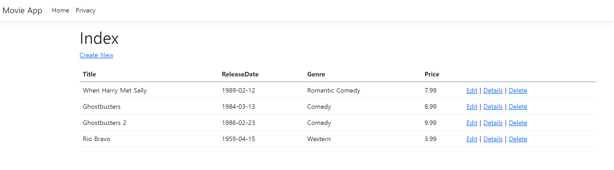

# asp.net_mvc_tuto

### 자습문서

https://learn.microsoft.com/ko-kr/aspnet/core/tutorials/first-mvc-app/start-mvc?view=aspnetcore-8.0&tabs=visual-studio

###### [Get started with ASP.NET Core MVC](https://learn.microsoft.com/en-us/aspnet/core/tutorials/first-mvc-app/start-mvc?view=aspnetcore-8.0&tabs=visual-studio)

###### [Part 2, add a controller to an ASP.NET Core MVC app](https://learn.microsoft.com/en-us/aspnet/core/tutorials/first-mvc-app/adding-controller?view=aspnetcore-8.0&tabs=visual-studio)

###### [Part 3, add a view to an ASP.NET Core MVC app](https://learn.microsoft.com/en-us/aspnet/core/tutorials/first-mvc-app/adding-view?view=aspnetcore-8.0&tabs=visual-studio)

###### [Part 4, add a model to an ASP.NET Core MVC app](https://learn.microsoft.com/en-us/aspnet/core/tutorials/first-mvc-app/adding-model?view=aspnetcore-8.0&tabs=visual-studio)

자습을 .NET 8.0으로 진행하면서, 데이터베이스 패키지는 9.0버전으로 받아 진행에 문제가 있었다.

###### [Part 5, work with a database in an ASP.NET Core MVC app](https://learn.microsoft.com/en-us/aspnet/core/tutorials/first-mvc-app/working-with-sql?view=aspnetcore-8.0&tabs=visual-studio)

##### [Part 6, controller methods and views in ASP.NET Core](https://learn.microsoft.com/en-us/aspnet/core/tutorials/first-mvc-app/controller-methods-views?view=aspnetcore-8.0)

##### [Part 7, add search to an ASP.NET Core MVC app](https://learn.microsoft.com/en-us/aspnet/core/tutorials/first-mvc-app/search?view=aspnetcore-8.0)

##### [Part 8, add a new field to an ASP.NET Core MVC app](https://learn.microsoft.com/en-us/aspnet/core/tutorials/first-mvc-app/new-field?view=aspnetcore-8.0&tabs=visual-studio)

##### [Part 9, add validation to an ASP.NET Core MVC app](https://learn.microsoft.com/en-us/aspnet/core/tutorials/first-mvc-app/validation?view=aspnetcore-8.0)

##### [Part 10, examine the Details and Delete methods of an ASP.NET Core app](https://learn.microsoft.com/en-us/aspnet/core/tutorials/first-mvc-app/details?view=aspnetcore-8.0)
